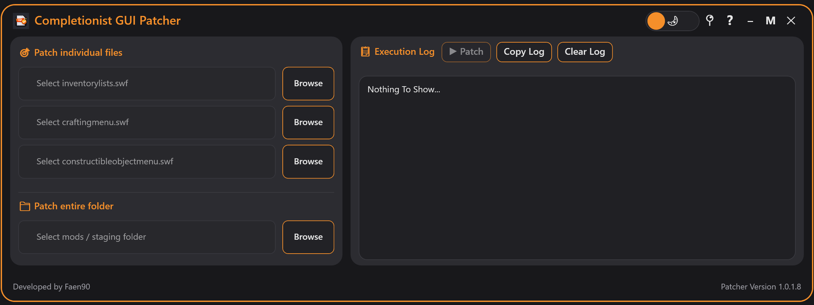

# 🎯 Completionist GUI Patcher


A modern desktop application that automatically adds completionist support to SWF files for The Elder Scrolls V: Skyrim – Special Edition. Parses `CompTag` and applies colored text to inventory, crafting, and constructible menus.



---

## ✨ Features

* **Patch individual files** – Select `inventorylists.swf`, `craftingmenu.swf`, or `constructibleobjectmenu.swf` and patch with one click.
* **Patch entire folders** – Point to your MO2 mods folder or Vortex staging folder; the patcher recursively finds all matching SWF files.
* **Automatic backup** – Original files are saved as `.completionist_backup` before any changes.
* **Dark / Light theme** – Toggle between modern dark and light UI.
* **Auto-update** – Checks for new versions on startup and can download & install updates.
* **Built-in FFDec downloader** – Automatically fetches the latest FFDec nightly if missing.
* **Execution log** – See exactly what the patcher is doing; copy or clear the log anytime.

---

## 📦 Requirements

* Windows 10 / 11 (64‑bit recommended)
* .NET 8.0 Desktop Runtime (if not already installed)
* No manual FFDec installation – the patcher downloads it for you.

---

## 🚀 Download & Install

1. Go to the [Releases](https://github.com/Faen668/Completionist-GUI-Patcher/releases) page.
2. Download the latest `Completionist.GUI.Patcher.zip`.
3. Extract the zip to any folder (e.g., `C:\Games\CompletionistPatcher`).
4. Run `Completionist GUI Patcher.exe`.

⚠️ Windows SmartScreen may warn – this is normal for unsigned utilities. Click **More info** → **Run anyway**.

---

## 🎮 How to Use

### Patch a single SWF file

1. Click **Browse** next to the file you want to patch.
2. Navigate to your game’s folder (or wherever the SWF resides).
3. Select the correct `.swf` file.
4. Click ▶ **Patch**.
5. Wait for the log to show success – a backup will be created alongside the original.

### Patch an entire mod folder

1. Under "Patch entire folder", click **Browse**.
2. Select your mod manager’s staging folder:

   * MO2: `<MO2 Folder>/mods/`
   * Vortex: `<Vortex Folder>/mods/`
3. Click ▶ **Patch** – the patcher will scan all subfolders and patch every matching SWF it finds.

### Restore a backup

If something goes wrong, delete the patched SWF and rename the `.completionist_backup` file to its original name (remove the extra extension).

---

## 🛠️ Building from Source

Clone the repository:

```
git clone https://github.com/Faen668/Completionist-GUI-Patcher.git
cd Completionist-GUI-Patcher
```

Open the solution in Visual Studio 2022 (or newer).
Restore NuGet packages.
Build in Release mode for `net8.0-windows`.
Output will be in `bin\Release\net8.0-windows`.

To create a release zip, run the provided `create_release.ps1` script.

---

## 🧠 How It Works

The patcher uses FFDec (JPEXS Free Flash Decompiler) to:

1. Extract ActionScript from the target SWF.
2. Locate the function that reads item names (`var _locX_ = a_entryObject.text;`).
3. Inject code that splits the text on `CompTag` and optionally changes the text color.
4. Recompile the SWF with the modified script.

Result: any item name containing `CompTag` (e.g., `Iron Sword CompTag#FFAA00`) will display only the part before the tag, and the text will be colored according to the hex value after the tag.

---

## ❓ FAQ

**Q: Why do I need FFDec?**
A: The patcher doesn't include a full SWF compiler – FFDec is the industry standard for Flash decompilation and recompilation.

**Q: Will this work with my mod manager?**
A: Yes. Works with manually installed mods, MO2, Vortex, or any folder structure with SWF files.

**Q: Is the patcher safe?**
A: Yes. It creates a backup before modifying any file. The code is open source, so you can review every change.

**Q: What does "already has completionist support" mean?**
A: The SWF file has already been patched by this tool (or another mod that adds CompTag parsing). No action is taken to avoid double‑patching.

**Q: Can I use this for other SWF files?**
A: Currently only `inventorylists.swf`, `craftingmenu.swf`, and `constructibleobjectmenu.swf` are supported. Pull requests for additional menus are welcome!

---

## 🤝 Contributing

Contributions, bug reports, and feature requests are welcome! Open an Issue or submit a Pull Request.

**Development setup:**

* Target framework: .NET 8.0
* UI: WPF (XAML)
* External tool: FFDec (downloaded automatically)

---

## 📜 License

This project is licensed under the MIT License – see the LICENSE file for details.

---

## 🙏 Credits

* Faen90 – Developer
* JPEXS FFDec – The Flash decompiler that makes this possible
* The modding community for inspiration and testing

---

Happy modding! 🎮✨
